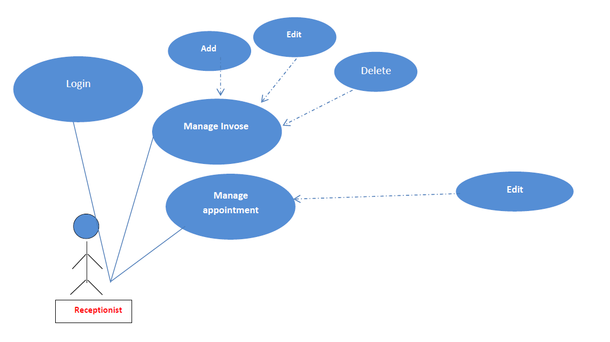
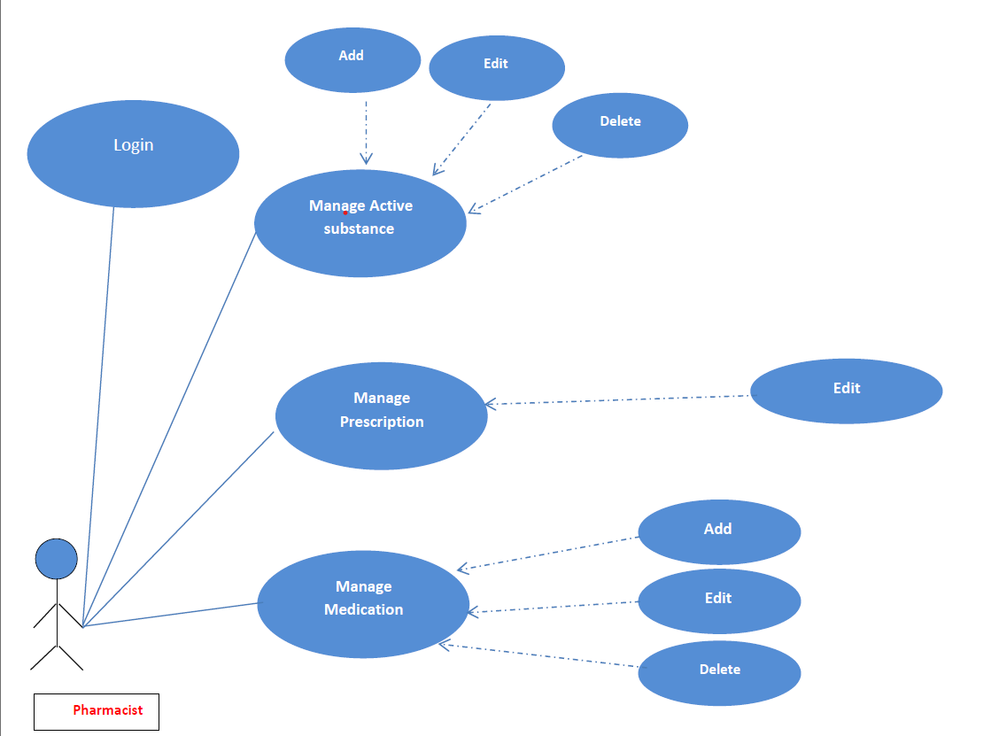
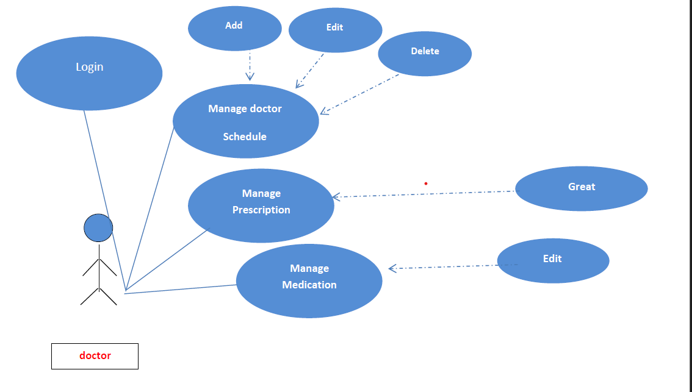
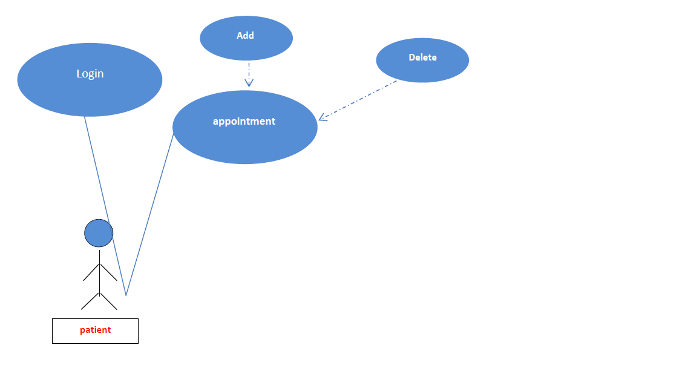
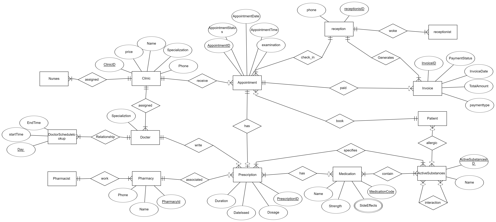

# Hospital Management System

## Overview
The Hospital Management System (HMS) is a software solution designed to streamline hospital operations, improve patient care, and enhance administrative efficiency. It enables hospital staff to manage patient records, doctor schedules, appointments, billing, and much more, all through a modern, user-friendly interface.

### for preview: http://hmspro.runasp.net/
---

## Features

### Functional Highlights:
1. **Patient Management**: Add, edit, and store patient data, including personal details, medical history, and contact information.
2. **Doctor Management**: Manage doctor information, specialties, and schedules.
3. **Appointment Scheduling**: Book, reschedule, and cancel patient appointments.
4. **Billing and Payment**: Generate bills, process payments, and maintain transaction records.
5. **Medical Records Management**: Store and retrieve diagnoses, prescriptions, and treatment histories.

### Unique Selling Points:
- **Intuitive User Interface**: Modern design for smooth navigation.
- **Flexible Appointment Scheduling**: Book appointments on short notice.
- **Efficient Check-in Process**: Minimize waiting times with automated check-ins.
- **Broader Accessibility**: Available for both university and non-university users.

---

## Architecture
### Key Modules:
- **Admin Dashboard**: User management, system settings, and access controls.
- **Doctor Portal**: Access patient records, update schedules, and manage prescriptions.
- **Receptionist Tools**: Handle appointments, check-ins, and patient inquiries.
- **Billing System**: Process and manage payments seamlessly.
- **Pharmacist Module**: Assign medications based on prescriptions.

### Core Technologies:
- **Framework**: ASP.NET Core MVC.
- **Frontend**: Razor Pages, Bootstrap.
- **Backend**: Entity Framework Core.
- **Database**: SQL Server.

---

## Requirements

### Functional Requirements:
1. Admin should be able to manage doctors, nurses, pharmacists, receptionists, and clinics.
2. Receptionists must manage appointments and check-ins efficiently.
3. Doctors can access patient records and update treatment details.
4. Billing must handle invoices and payment processing securely.

### Non-Functional Requirements:
- **Performance**: All actions must complete within 3 seconds.
- **Security**: Use encryption for sensitive data and secure login mechanisms.
- **Availability**: Ensure 24/7 availability with minimal downtime.

---

## Installation

### Prerequisites:
1. .NET SDK version 6 or higher.
2. SQL Server.
3. Visual Studio 2022 or any compatible IDE.

### Steps:
1. Clone the repository:
   ```bash
   git clone https://github.com/HMS_project/hospital-management-system.git
   ```
2. Navigate to the project directory:
   ```bash
   cd HMS_project
   ```
3. Restore packages:
   ```bash
   dotnet restore
   ```
4. Apply database migrations:
   ```bash
   dotnet ef database update
   ```
5. Run the application:
   ```bash
   dotnet run
   ```

---

## Usage
1. Log in as an admin, doctor, receptionist, or pharmacist.
2. Access respective modules to manage data or processes.
3. Use the intuitive UI to navigate and perform tasks efficiently.

---

## UML Diagrams
- **Use Case Diagrams**: Highlight system interactions for different roles.
- 
  ---
- 
  ---
- 
  ---
- 
  ---
- 
  ---
- **Entity Relationship Diagram (ERD)**: Show relationships between database entities like Patients, Doctors, Appointments, and Prescriptions.
- 

---

## Future Enhancements
1. **Mobile App**: Extend functionality to mobile platforms for on-the-go usage.
2. **AI Integration**: Predictive analytics for patient management and scheduling.
3. **Telemedicine**: Support virtual consultations.

---

## Contributors
- **Mostafa Labib**: Project Lead.
- **Fares Mahmoud**
- **Ammar Barakat**
- **Mohamed Saad**
- **Mohammadi Alaa**
- **Ahmed Ali**
- **Ahmed ElShafay**
- **Ahmed ElShafay**


